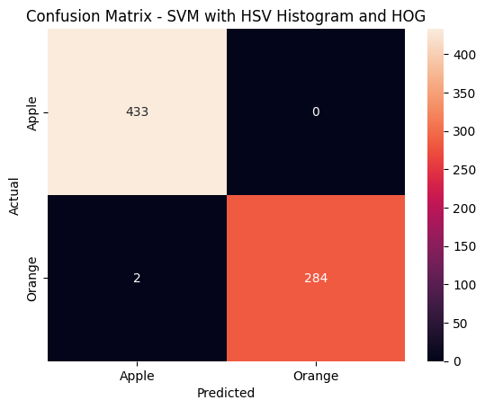
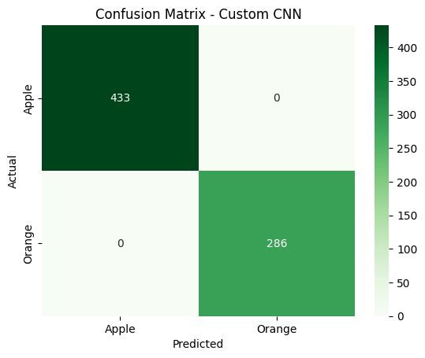
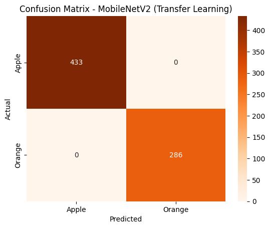
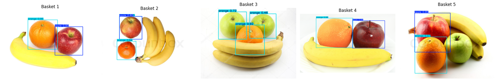
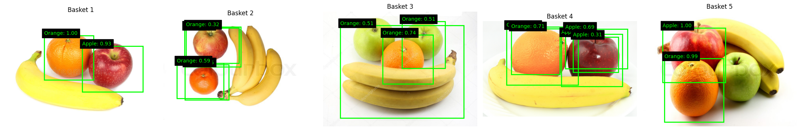
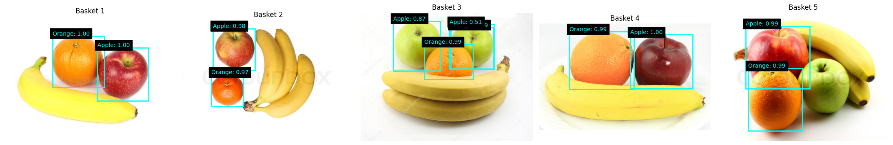

# 🍎 Apple vs Orange Computer Vision

A comprehensive computer vision project comparing **traditional machine learning**, **deep learning**, **transfer learning**, and **object detection** techniques for fruit recognition.

---

## Project Overview

This project investigates multiple computer vision approaches for classifying and detecting apples and oranges using publicly available datasets from Kaggle.

Rather than relying on a single model, the project compares several techniques ranging from classical computer vision to modern deep learning and object detection architectures.

The study evaluates each model using multiple performance metrics including:

* Accuracy
* Precision
* Recall
* F1-score
* Mean Average Precision (mAP)
* Inference Speed (FPS)
* Training Time

---

## Objectives

* Build image classification models for Apple vs Orange recognition.
* Compare traditional feature engineering against deep learning.
* Implement transfer learning using MobileNetV2.
* Build multiple object detection models.
* Compare detection accuracy and inference speed.
* Analyse trade-offs between accuracy and computational efficiency.

---

## Dataset

### Image Classification

**Fruits-360 Dataset**

The Fruits-360 dataset contains thousands of labelled fruit images captured under controlled conditions.

Classes used:

* Apple
* Orange

Dataset:
https://www.kaggle.com/datasets/moltean/fruits

---

### Object Detection

A fruit detection dataset with bounding box annotations was used for object detection experiments.

Classes:

* Apple
* Orange

Bounding box annotations were converted into the required formats for each detection model.

---

## Image Classification Models

### 1. Support Vector Machine (SVM)

Features extracted:

* HSV Color Histogram
* Histogram of Oriented Gradients (HOG)

Purpose:

Represents a traditional machine learning pipeline without deep learning.

## Support Vector Machine


---


### 2. Custom Convolutional Neural Network (CNN)

Architecture includes:

* Convolution layers
* Max Pooling
* Dense layers
* Dropout
* Sigmoid Output

## Custom CNN


---

### 3. MobileNetV2 (Transfer Learning)

A pretrained MobileNetV2 model was fine-tuned for binary fruit classification.

Transfer learning significantly reduced training time while achieving excellent classification performance.

## Custom CNN


---

## Object Detection Models

### YOLOv8

Single-stage detector optimized for real-time detection.
## YOLOv8



---

### SSD Lite

Lightweight detector suitable for edge devices.
## SSD



---

### Faster R-CNN

Two-stage detector providing higher localization accuracy at the expense of inference speed.
## Faster R-CNN


---

## Technologies Used

* Python
* OpenCV
* Scikit-learn
* TensorFlow / Keras
* PyTorch
* Torchvision
* Ultralytics YOLOv8
* NumPy
* Matplotlib
* Seaborn

---

## Results

### Classification

| Model       | Accuracy |
| ----------- | -------- |
| SVM         | 99.7%    |
| Custom CNN  | 100%     |
| MobileNetV2 | 100%     |

---

### Detection

The object detection models were evaluated using:

* mAP@50
* mAP@50-95
* Recall
* FPS

YOLO achieved the best balance between accuracy and inference speed, while Faster R-CNN demonstrated strong localization performance with higher computational cost.

---

## Repository Structure

```
notebooks/
images/
README.md
requirements.txt
```

---

## Future Improvements

* Multi-class fruit detection
* Real-time webcam deployment
* Mobile deployment
* Quantization and model compression
* Model explainability using Grad-CAM

---

## Author

**Diviyah**

Master of Business Analytics

Machine Learning • Computer Vision • Artificial Intelligence
